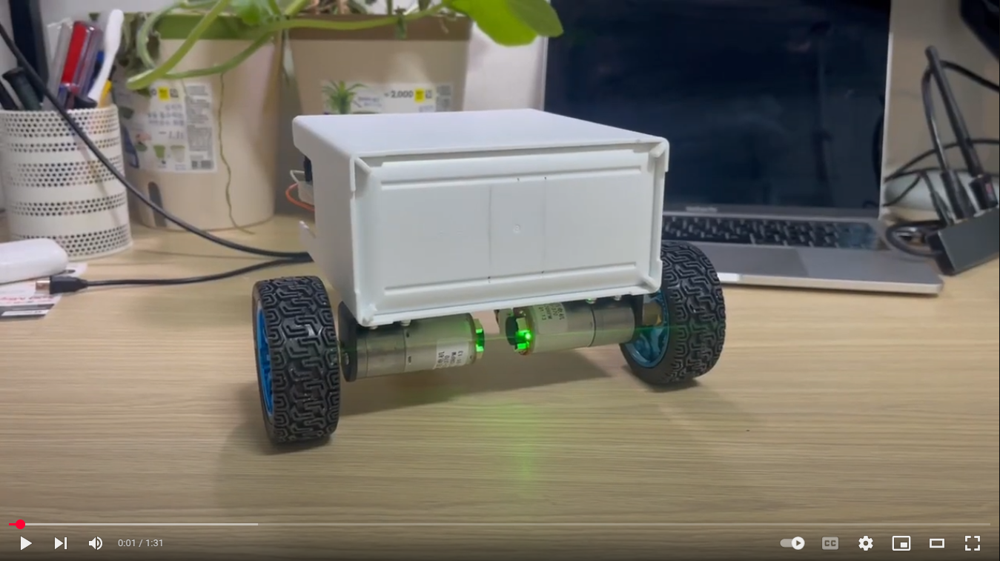

# autoJetsonBot

**autoJetsonBot** is a high-performance, modular ROS 2 Foxy-based autonomous mobile robot platform designed specifically for the NVIDIA Jetson Nano B01. It bridges the gap between sophisticated simulation and real-world hardware integration, providing a robust framework for SLAM, navigation, and object detection.

---
[](https://youtu.be/JTg8ff2hSGM?si=UqfauM6vN_xyPFOV)
---

## 📊 Project Status: Navigation Active 🚀

The robot has been fully refactored to the **Industry Standard (REP 120)**. All core systems are synchronized to the `base_footprint` root projection, ensuring seamless coordinate transformations across the entire stack.

### System Health Snapshot
| System | Status | Technical Detail |
| :--- | :--- | :--- |
| **TF Tree** | ✅ Standardized | `map -> odom -> base_footprint -> base_link` (REP 120). |
| **Hardware** | ✅ Ready | Python Serial Bridge (`diffdrive_node`) active. |
| **Navigation** | ✅ Active | AMCL auto-localization + DWB Local Planner. |
| **Simulation** | ✅ Calibrated | 1:1 Digital Twin of physical hardware dimensions. |

---

## 🏗️ System Architecture (Modular)

The project is decomposed into specialized ROS 2 packages within the `src/` directory to maximize maintainability and scalability.

| Package | Responsibility | Key Components |
| :--- | :--- | :--- |
| **`jetson_bot_bringup`** | Orchestration | Launch files, world files, global config (`unified_robot_config.yaml`). |
| **`jetson_bot_description`**| Physical Model | URDF/XACRO definitions, mesh resources, sensor placements. |
| **`jetson_bot_gui`** | Web Dashboard | Telemetry server, roslibjs bridge, and real-time UI. |
| **`jetson_bot_slam`** | Environment Mapping| `slam_toolbox` configurations for asynchronous mapping. |
| **`jetson_bot_navigation`**| Path Planning | Nav2 parameters, Behavior Trees, and Local/Global planners. |
| **`jetson_bot_imu`** | Sensor Driver | Python driver for MPU6050 I2C communication. |
| **`jetson_bot_diffdrive`**| HW Interface | **Python Serial Bridge** for ESP32/Arduino communication. |
| **`jetson_bot_detection`** | Computer Vision | Image processing node for real-time detection. |

### Project Directory Layout
```text
autoJetsonBot/
├── README.md               # You are here
├── robot.sh                # Unified CLI Control Script
├── unified_robot_config.yaml # Global Source of Truth
├── Dockerfile.foxy         # Foxy/Ubuntu 20.04 Container Definition
├── src/                    # ROS 2 Source Workspace
│   ├── jetson_bot_bringup/  # Master Launch & Configs
│   ├── jetson_bot_description/ # URDF & Physical Model
│   ├── jetson_bot_gui/      # Web UI & Telemetry
│   ├── jetson_bot_navigation/ # Nav2 Stack Configs
│   ├── jetson_bot_slam/     # SLAM Toolbox Configs
│   ├── jetson_bot_imu/      # MPU6050 Driver
│   └── jetson_bot_detection/ # Vision Processing
├── maps/                   # Saved Occupancy Grid Maps (.yaml, .pgm)
├── assets/                 # Project images and diagrams
└── test_suite/             # Integration & Hardware Verification
```

---

## 🏎️ Hardware Specification (The "Digital Twin" Standard)

The platform is meticulously calibrated to a **1:1 Digital Twin standard**. Every parameter in the simulation exactly matches the physical hardware audit conducted on **2026-06-07**.

### 1. Physical Metrics & Kinematics
*   **Wheel Separation:** 0.212m (Center-to-center)
*   **Wheel Radius:** 0.034m (3.4cm)
*   **Ground Clearance:** 0.056m (Floor to chassis floor)
*   **Chassis Dimensions:** 19.4cm (L) x 17.8cm (W) x 9.7cm (H)
*   **Total Weight:** 1.4kg (Physics-accurate inertial distribution)

### 2. Compute & Intelligence
*   **Main Brain:** NVIDIA Jetson Nano B01 (4GB) – Executes the full ROS 2 stack and vision processing.
*   **Low-Level Controller:** ESP32 / Arduino – Real-time PID bridge for motors and encoders.
*   **HW Interface:** `jetson_bot_diffdrive` – A high-performance Python bridge using a human-readable serial protocol (`m v_l v_r\r`).

### 3. Sensing & Perception
*   **Lidar:** RPLidar A1 – Positioned at `x=0.064` (forward of axle) and `z=0.161` (from floor).
*   **IMU:** MPU6050 – Fuses 6-DOF data for improved odometry via future EKF integration.
*   **Encoders:** Hall-effect sensors (3436 counts/rev) – High-resolution position feedback.
*   **Vision:** Raspberry Pi Camera v2 – Serves MJPEG stream on port 8080 via `web_video_server`.

### 4. Power Management
*   **Battery:** 12V Li-ion (3S)
*   **Regulation:** Dual buck converters for isolated 5V (Jetson) and 5V/3.3V (Sensors) rails.
*   **Failsafe:** Software-defined Emergency Stop integrated into the Nav2 action stack.

---

## 🚀 Development Workflow (The `robot.sh` CLI)

We utilize a unified control script to manage the dockerized environment efficiently.

### Core Commands
| Command | Result |
| :--- | :--- |
| `./robot.sh build` | Rebuilds the modular workspace inside the container. |
| `./robot.sh auto` | **[NEW]** Auto-installs missing dependencies and builds. |
| `./robot.sh sim` | Launches Gazebo simulation + Web UI in **Mapping Mode**. |
| `./robot.sh nav` | Launches simulation + Nav2 in **Navigation Mode**. |
| `./robot.sh status` | Deep-inspects ROS nodes, topics, and port health. |
| `./robot.sh stop` | Robustly terminates all processes (including Gazebo/VNC). |

---

## 🗺️ Mapping & Navigation Steps

### Phase 1: Creating a Map
1.  Run `./robot.sh sim`.
2.  Use the Web UI or a joystick to drive the robot around the environment.
3.  Monitor mapping progress in RViz (via VNC at `localhost:5900`).
4.  Save the map dynamically:
    ```bash
    ./robot.sh shell "ros2 run nav2_map_server map_saver_cli -f /autonomous_ROS/maps/current_map"
    ```

### Phase 2: Autonomous Navigation
1.  Verify the map name in `src/jetson_bot_bringup/config/unified_robot_config.yaml`.
2.  Run `./robot.sh nav`.
3.  The robot will auto-localize at its starting point. Use **"2D Nav Goal"** in RViz to set a destination.
4.  The system uses the **DWB Local Planner** for smooth obstacle avoidance.

---

## 🧠 Project Continuity & Memory
To maintain long-term technical health, consult these primary documentation nodes:

1.  **[PROJECT_ANALYSIS.md](./PROJECT_ANALYSIS.md)**: Current roadmap, active blockers, and system status.
2.  **[AGENTS.md](./AGENTS.md)**: Repository of technical wisdom, bug fixes, and "hard-won" lessons.
3.  **[SESSION_LOG.md](./SESSION_LOG.md)**: Detailed chronological history of all development sessions.
4.  **[GEMINI.md](./GEMINI.md)**: Core mandates, architectural conventions, and standard workflows.

---

## 📜 License
Licensed under the MIT License. Based on the [Autonomous ROS](https://github.com/jakhon37/autonomous_ROS) project.

*For issues or contributions, please contact jakhon37@gmail.com*
