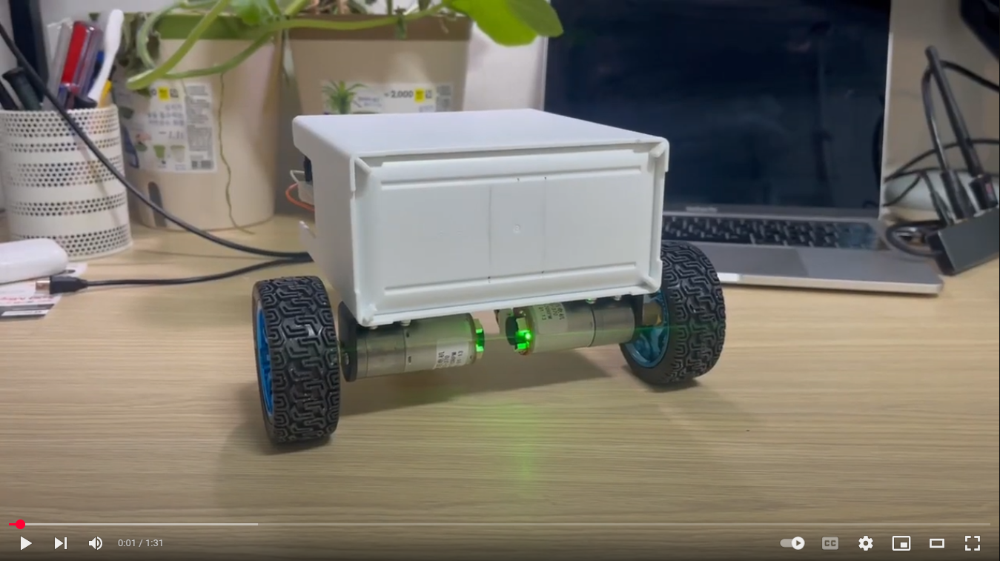
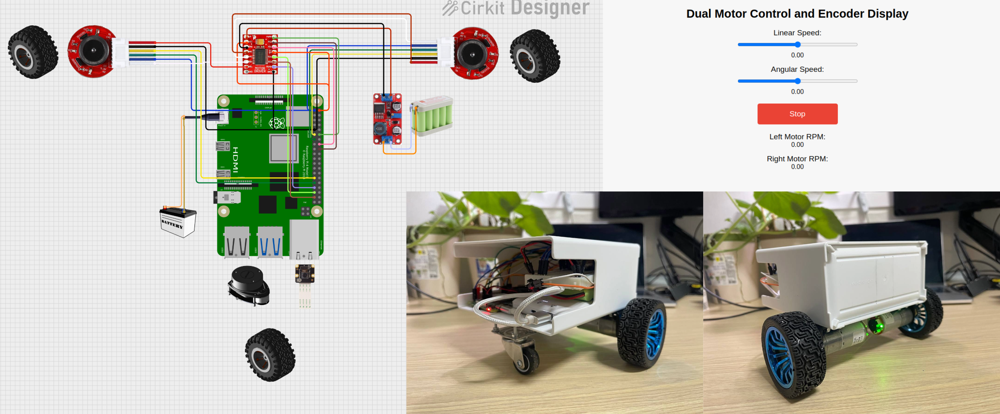

### continuation of [Autonomous ROS](https://github.com/jakhon37/autonomous_ROS) Project with Jetson Nano B1 on
# Autonomous Jetson Robot

This project develops a mobile robot platform for autonomous navigation by integrating multiple sensors and actuators. Powered by a Jetson Nano B01, the system combines motor control, encoder-based feedback, LIDAR scanning, Simultaneous Localization and Mapping (SLAM), navigation, Reinforcement Learning (RL)-based autonomous path planning, camera vision, and object detection capabilities.
---
[](https://youtu.be/JTg8ff2hSGM?si=UqfauM6vN_xyPFOV)
---

### **To-Do List**

✅ **Physical Robot Design & Circuit Setup** – Robot base and hardware assembly  
✅ **Robot Description (URDF & xacro)** – Define robot joints and links for ROS 2  
✅ **Gazebo & RViz2 Setup** – Simulate the robot in a virtual environment  
✅ **Dual Motor Control Node** – Implement motor control for mobility  
✅ **Encoder Node** – Use encoder data for odometry (ODOM)  
✅ **Remote Motor Control** – Web-based GUI for manual control  
✅ **RP-Lidar & Scan Node Setup** – Configure Lidar for scanning  

💭 **SLAM (Simultaneous Localization & Mapping)** – Create an environment map and localize the robot  
💭 **Navigation (nav2)** – Implement path following and autonomous goal reaching  
💭 **Path Planning AI (Reinforcement Learning)** – Train an RL agent for navigation in unseen environments  
💭 **Camera & Camera Node Setup** – Integrate a camera for vision processing  
💭 **Object Detection** – Improve localization and navigation with vision-based detection  

---



---

## Table of Contents

- [Hardware Components](src/robot_body/readme_body.md)
- [Circuit Connection & Wiring Details](#circuit-connection--wiring-details)
- [Software Overview and Nodes](#software-overview-and-nodes)
  - [Dual Motor Control Node](#dual-motor-control-node)
  - [Encoder Node](#encoder-node)
  - [Web GUI Node](#web-gui-node)
  - [RP‑Lidar Scan Node (In Progress)](#rp-lidar-scan-node-in-progress)
  - [SLAM Node (In Progress)](#slam-node-in-progress)
  - [Navigation Node (In Progress)](#navigation-node-in-progress)
  - [RL Path Planning Node (In Progress)](#path-planning-node-in-progress)
  - [Camera / Object Detection Node (In Progress)](#camera--object-detection-node-in-progress)
- [Installation and Launch Instructions](#installation-and-launch-instructions)
- [Dockerization](#dockerization)
- [License](#license)

---


## Installation and Launch Instructions

1. **Build the Workspace:**  
   From the workspace root (`autonomous_ROS/`):
   ```bash
   colcon build
   source install/setup.bash
   ```

2. **Launch All Nodes:**  
   Use the unified launch file in the `my_robot_launch` package:
   ```bash
   ros2 launch my_robot_launch all_nodes_launch.py
   ```
   This will:
   - Launch autonomous car nodes (motor control, encoder, etc.)
   - Start the rosbridge server (on port 9090)
   - Start the HTTP server (serving the web GUI on port 8000)

3. **Access the Web GUI:**  
   Open a web browser on a device in the same network and navigate to:
   ```
   http://<raspberry_pi_ip>:8000
   ```
   For example, if the Pi's IP is `192.168.219.100`, use:
   ```
   http://192.168.219.100:8000
   ```

4. **Remote Visualization (Optional):**  
   Run RViz on another machine (with ROS 2 Humble) to view topics such as `/map` and `/scan`.

---

## Dockerization

To simplify deployment and ensure a consistent environment, you can containerize your project using Docker.

### Example Dockerfile

Place check Dockerfile in the root directory (`autonomous_ROS/Dockerfile`)

### Building and Running the Docker Container

1. **Build the Image:**
   ```bash
   docker build -t autonomous_ros_project .
   ```

2. **Run the Container (using host networking for ROS 2 DDS discovery):**
   ```bash
   docker run -d \
    --privileged \
    --restart=always \
    --name auto_ros \
    --network=host \
    autonomous_ros_project

   ```

3. **Access the Web GUI:**  
   Open a browser and navigate to:
   ```
   http://<raspberry_pi_ip>:8000
   ```

---

## License

This project is licensed under the MIT License. Feel free to modify, distribute, or use this code for personal, educational, or commercial purposes, provided proper attribution is given.

---

*For issues or contributions, please contact jakhon37@gmail.com*
